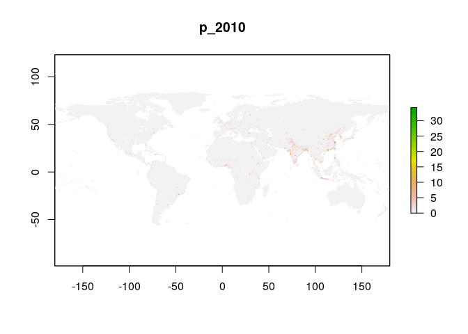
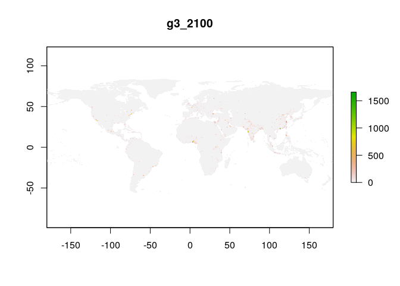

<!-- README.md is generated from README.Rmd. Please edit that file -->
popgrids
========

[](https://travis-ci.org/Nowosad/popgrids) [](https://doi.org/10.5281/zenodo.1162868)

This dataset consists 0.5 × 0.5 degree grids of:

1.  Global population and GDP estimations for years 1980-2010 created by downscaling actual populations and GDPs by country, and
2.  Global population and GDP projections for years 2020-2100 created by downscaling projected populations and GDPs under three shared socioeconomic pathways (SSP): SSP1; SSP2; and SSP3.

The dataset is modified [Global dataset of gridded population and GDP scenarios, version 3](http://www.cger.nies.go.jp/gcp/population-and-gdp.html). While the original dataset is a shapefile of 0.5 × 0.5 degree grids masked by countries, the new one contains a regular grid in form of raster objects.

Code used to create this data is at <https://github.com/Nowosad/global_population_and_gdp>.

Installation
------------

Get the development version from github:

``` r
# install.packages("devtools")
devtools::install_github("Nowosad/popgrids")
```

Examples
--------

``` r
library(popgrids)
library(sp)
library(raster)
```

#### Population estimation for 2010

``` r
plot(pop_grid, "p_2010")
```



#### GDPs projections for 2100 (pathway SSP3)

``` r
plot(gdp_grid, "g3_2100")
```


